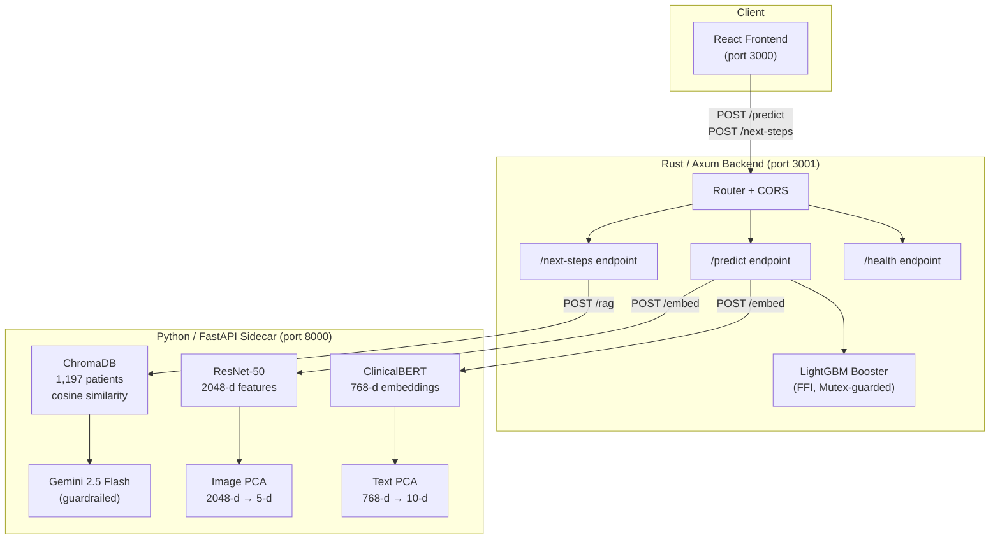
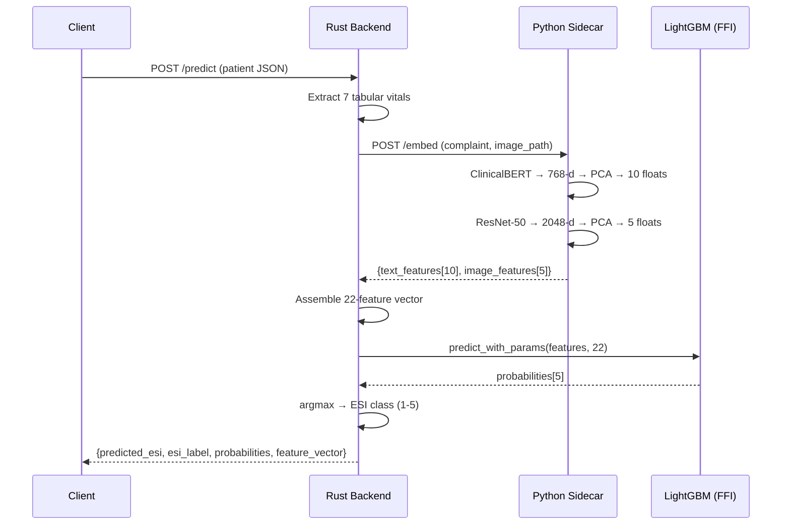
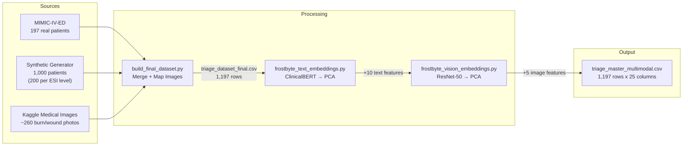
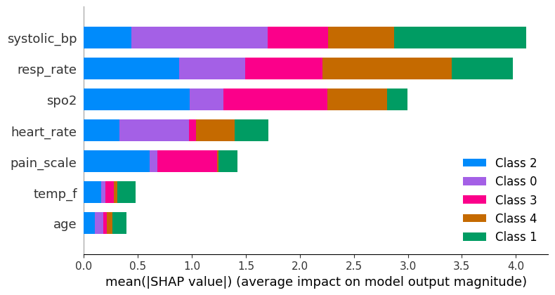
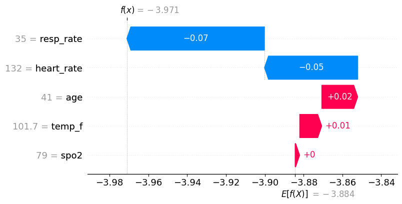
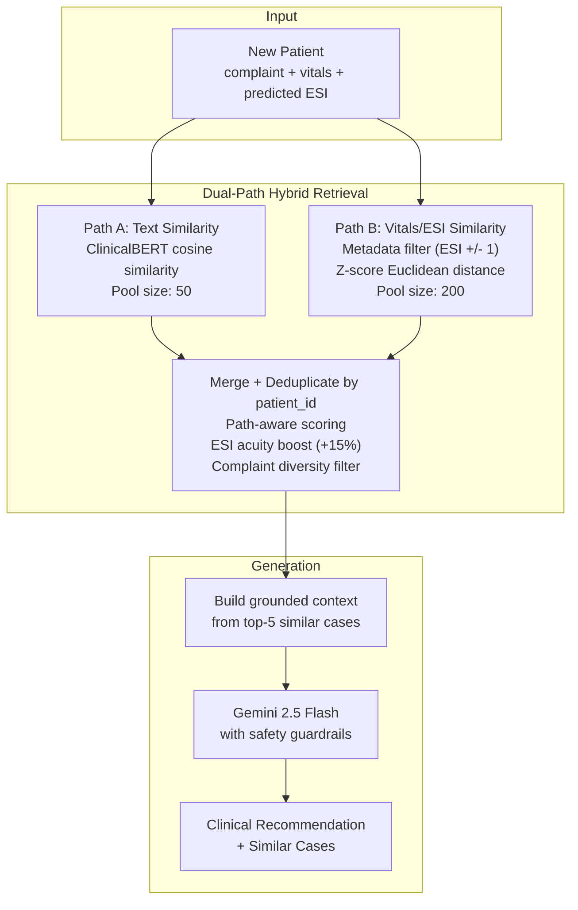
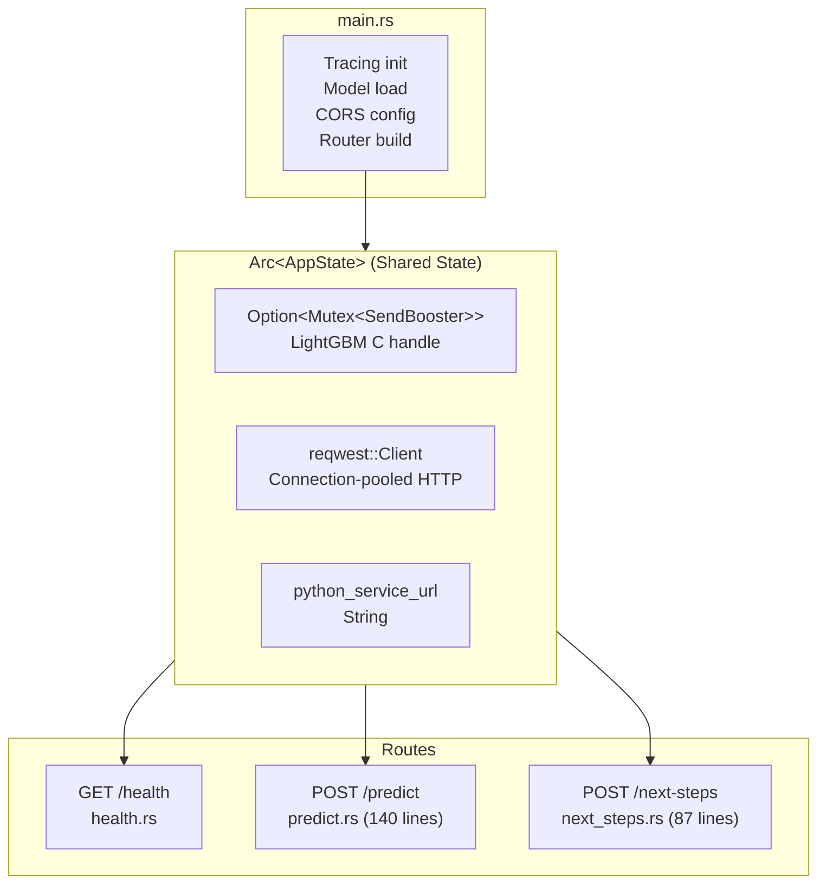
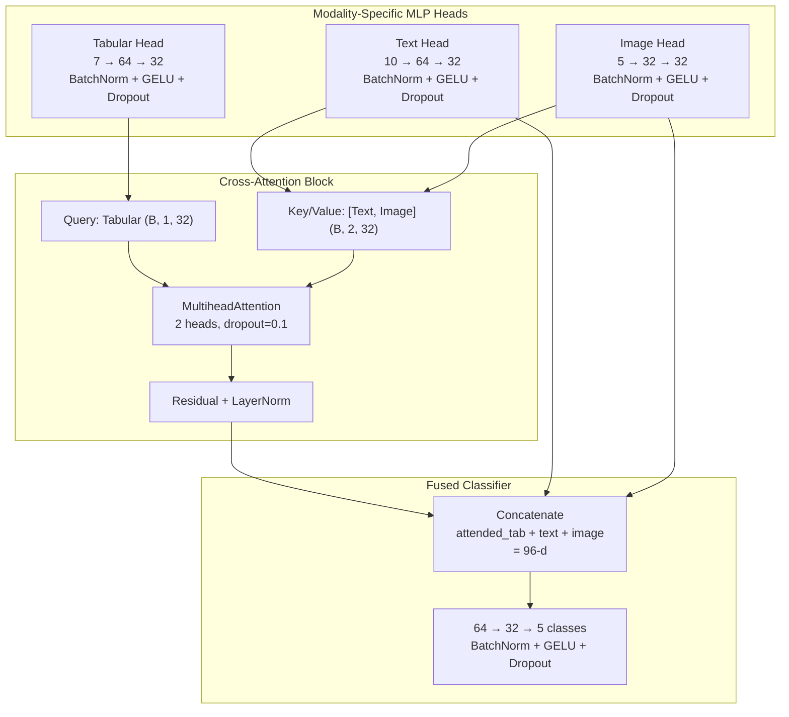

# Multimodal AI Triage Assistant for Emergency Departments

A production-grade late-fusion multimodal AI system that predicts Emergency Severity Index (ESI) levels for emergency department triage. The system fuses three clinical data modalities -- structured vitals, unstructured text, and medical imagery -- through a LightGBM meta-model served via a high-performance Rust backend, augmented by a Retrieval-Augmented Generation (RAG) engine for clinical decision support.

Built for the Frostbyte Hackathon (March 2026).


---

## Table of Contents

1. [Problem Statement and Motivation](#1-problem-statement-and-motivation)
2. [System Architecture](#2-system-architecture)
3. [Technology Stack](#3-technology-stack)
4. [Data Engineering Pipeline](#4-data-engineering-pipeline)
5. [Modality Extraction](#5-modality-extraction)
6. [Model Training and Results](#6-model-training-and-results)
7. [Clinical RAG Engine](#7-clinical-rag-engine)
8. [Rust Inference Backend](#8-rust-inference-backend)
9. [API Reference](#9-api-reference)
10. [Setup and Quickstart](#10-setup-and-quickstart)
11. [Research Prototype: Cross-Attention Neural Fusion](#11-research-prototype-cross-attention-neural-fusion)
12. [Project Structure](#12-project-structure)

---

## 1. Problem Statement and Motivation

Emergency departments face a fundamental **accuracy paradox**. Critical patients (ESI 1 -- Resuscitation) represent fewer than 2% of all ED visits. Standard machine learning models trained on raw clinical data learn to exploit this class imbalance, defaulting to moderate acuity predictions (ESI 3) for the majority of cases. The result is a model that achieves high aggregate accuracy while systematically failing on the cases where failure has lethal consequences.

**Our approach:** We constructed a hybrid dataset anchoring 197 real patients from the [MIMIC-IV-ED](https://physionet.org/content/mimic-iv-ed/) clinical database with 1,000 deterministic, synthetically generated patients. This forced minority-class oversampling establishes strict physiological decision boundaries that prioritize patient safety over blind statistical optimization.

**Key result:** The production model achieves 90% overall accuracy with **1.00 precision and 1.00 recall on ESI 1 (Resuscitation) cases** -- zero missed critical patients in evaluation.

---

## 2. System Architecture

The production system is a two-process microservice architecture. The Rust backend handles routing, feature assembly, and native LightGBM inference via FFI. The Python sidecar handles ML preprocessing that requires HuggingFace models (no Rust equivalents exist).



### Request Flow: `/predict`



---

## 3. Technology Stack

| Layer | Technology | Role |
|:------|:-----------|:-----|
| Inference Backend | Rust 2021, Axum 0.8, Tokio | Async HTTP server, request routing, CORS |
| ML Inference | LightGBM via `lightgbm3` FFI crate | Native 5-class ESI prediction from 22-feature vector |
| Text Embeddings | `emilyalsentzer/Bio_ClinicalBERT` | 768-dimensional [CLS] token extraction from chief complaints |
| Vision Embeddings | ResNet-50 (ImageNet weights) | 2048-dimensional feature maps from wound/burn images |
| Dimensionality Reduction | scikit-learn PCA | Text: 768 to 10 components. Image: 2048 to 5 components |
| Vector Database | ChromaDB (in-memory, HNSW) | Cosine-similarity patient retrieval for RAG |
| LLM Generation | Google Gemini 2.5 Flash | Guardrailed clinical recommendation generation |
| Preprocessing Service | Python 3.10+, FastAPI, Uvicorn | ML model serving sidecar for BERT/ResNet/RAG |
| Explainability | SHAP `TreeExplainer` | Local waterfall and global importance plots |
| Research Prototype | PyTorch | Cross-attention multimodal fusion network (V2) |
| Data Sources | MIMIC-IV-ED, Kaggle Medical Images | 197 real + 1,000 synthetic = 1,197 patients |

---

## 4. Data Engineering Pipeline

### 4.1 Dataset Construction



### 4.2 Synthetic Data Generation

The synthetic generator (`dataset.py`) creates 1,000 patients with deterministic ESI clinical profiles. Each ESI level has medically grounded vital sign ranges and complaint templates:

| ESI Level | Heart Rate | SpO2 | Systolic BP | Example Complaints |
|:----------|:-----------|:-----|:------------|:-------------------|
| 1 (Resuscitation) | 130-180 | 75-89% | 60-90 | Cardiac arrest, Massive hemorrhage |
| 2 (Emergent) | 110-140 | 90-94% | 160-200 | Crushing chest pain, Stroke symptoms |
| 3 (Urgent) | 80-110 | 94-98% | 110-140 | Fever and cough, Closed fracture |
| 4 (Less Urgent) | 60-100 | 97-100% | 100-130 | Sprained ankle, Minor burn |
| 5 (Non-Urgent) | 60-90 | 98-100% | 110-120 | Medication refill, Cold symptoms |

200 patients per ESI level ensures balanced class representation. The generator is seeded (`np.random.seed(42)`) for full reproducibility.

### 4.3 Real Data Integration

197 patients from MIMIC-IV-ED (`triage.csv`) are cleaned, standardized to the synthetic schema, and merged. The `build_final_dataset.py` script handles:
- Pain score normalization (MIMIC uses free-text pain scores that require parsing)
- Missing vital imputation
- High-risk flag derivation (ESI 1-2 = high risk)
- Image path mapping: chief complaints containing "burn" are mapped to Kaggle burn images; "laceration" or "fracture" to wound images

### 4.4 Final Feature Vector Layout

The master dataset (`triage_master_multimodal.csv`) contains 25 columns. The 22 features used for model inference are:

```
Index  0-6:   Tabular Vitals    [age, heart_rate, resp_rate, spo2, temp_f, systolic_bp, pain_scale]
Index  7-16:  Text PCA           [text_feat_0 .. text_feat_9]
Index  17-21: Image PCA          [img_feat_0 .. img_feat_4]
```

---

## 5. Modality Extraction

### 5.1 Modality 1: Tabular Vitals (7 features)

Raw physiological measurements passed directly to the model without transformation:

| Feature | Description | Range |
|:--------|:------------|:------|
| `age` | Patient age in years | 18-89 |
| `heart_rate` | Beats per minute | 43-179 |
| `resp_rate` | Breaths per minute | 12-44 |
| `spo2` | Blood oxygen saturation (%) | 75-100 |
| `temp_f` | Body temperature (Fahrenheit) | 36.5-103.5 |
| `systolic_bp` | Systolic blood pressure (mmHg) | 60-218 |
| `pain_scale` | Self-reported pain (0-10) | 0-10 |

### 5.2 Modality 2: Clinical Text Embeddings (10 features)

**Model:** `emilyalsentzer/Bio_ClinicalBERT` -- a BERT model pre-trained on MIMIC-III clinical notes.

**Pipeline:**
1. Tokenize chief complaint text (max length 64 tokens, batch size 16)
2. Forward pass through ClinicalBERT
3. Extract the 768-dimensional `[CLS]` token embedding from the last hidden state
4. Compress via PCA from 768 to 10 components

**Why 10 dimensions:** With only 7 tabular features, preserving all 768 text dimensions would allow the text modality to dominate the tree splits. PCA to 10 components keeps the text signal informative while maintaining proportional influence relative to the tabular features.

### 5.3 Modality 3: Visual Features (5 features)

**Model:** ResNet-50 with ImageNet pre-trained weights, final fully-connected classification layer replaced with `Identity()` to expose the 2048-dimensional feature map.

**Pipeline:**
1. Standard ImageNet preprocessing: Resize(256), CenterCrop(224), Normalize
2. Forward pass through the modified ResNet-50
3. Extract 2048-dimensional feature vector
4. Compress via PCA from 2048 to 5 components

**Missing modality handling:** 28 of 1,197 patients have actual Kaggle wound/burn images. The remaining 1,169 patients receive zero-padded image feature vectors `[0.0, 0.0, 0.0, 0.0, 0.0]`.

The PCA transform is fitted **exclusively** on the 28 real image embeddings. This is a deliberate design choice: if PCA were fitted on all 1,197 rows (including the 1,169 zero vectors), mean-centering would shift the zero vectors to non-zero positions, creating spurious visual features for patients without images. By fitting only on real data, the zero vectors remain at the origin of the PCA-transformed space, functioning as a mathematical "off-switch" that tells the model: "no visual information is available for this patient."

---

## 6. Model Training and Results

### 6.1 Production Model: LightGBM Late-Fusion

The production meta-model is a gradient-boosted decision tree ensemble that ingests all three modalities as a flat 22-feature vector.

**Configuration:**

| Parameter | Value |
|:----------|:------|
| Algorithm | LightGBM (`LGBMClassifier`) |
| Estimators | 200 |
| Learning Rate | 0.05 |
| Max Depth | 6 |
| Num Leaves | 31 |
| Class Weight | `balanced` |
| Objective | Multiclass (5 classes) |
| Train/Test Split | 80/20 stratified (`random_state=42`) |

**Overall Accuracy: 90%**

### 6.2 SHAP Explainability

The system uses `shap.TreeExplainer` to generate three types of explanations:

1. **Global Feature Importance** -- Bar chart showing which features drive the model's decisions across all patients
2. **ESI-1 Beeswarm** -- Feature directionality plot for the critical resuscitation class
3. **Local Waterfall** -- Single-patient explanation answering "Why was this patient classified as ESI 1?"

These visualizations solve the medical "black box" problem by providing clinical staff with transparent, auditable reasoning for every triage decision.

| Global Feature Importance | Critical Patient Waterfall |
|:------------------------:|:--------------------------:|
|  |  |

### 6.3 Model Artifacts

| File | Format | Description |
|:-----|:-------|:------------|
| `triage_multimodal_model(1).txt` | LightGBM native text | 19,157-line model dump loaded by Rust FFI |
| `triage_multimodal_model.pkl` | Python pickle | Scikit-learn compatible serialization |

---

## 7. Clinical RAG Engine

The RAG (Retrieval-Augmented Generation) engine transforms the model's raw ESI prediction into actionable clinical guidance. Rather than generating recommendations from parametric knowledge alone, it retrieves historically similar patients and grounds its output in real case data.

### 7.1 Architecture Overview



### 7.2 Dual-Path Hybrid Retrieval

Standard single-path text retrieval fails when semantically dissimilar complaints describe physiologically identical emergencies. For example, "Unresponsive, found on floor" and "Cardiac arrest" describe ESI 1 scenarios with similar vitals, but ClinicalBERT may place them in distant embedding clusters.

The hybrid retrieval system solves this with two independent retrieval paths:

**Path A (Text):** Embeds the query complaint via ClinicalBERT (768-d), queries ChromaDB for the 50 nearest neighbors by cosine similarity. This captures semantic similarity in chief complaint language.

**Path B (Vitals/ESI):** Filters ChromaDB by ESI metadata (predicted ESI +/- 1 level), then ranks the resulting candidates purely by physiological similarity using z-score normalized Euclidean distance across six vital signs. This path is completely independent of text embeddings.

**Merge and Scoring:**

Candidates from both paths are merged and deduplicated by `patient_id`. The scoring adapts based on which path(s) found each candidate:

| Source | Scoring Formula | Rationale |
|:-------|:----------------|:----------|
| `"both"` (found by both paths) | `alpha * text_sim + (1 - alpha) * vitals_sim` | Best case: concordant signal from both modalities |
| `"text"` (text path only) | `alpha * text_sim + (1 - alpha) * vitals_sim` | Vitals similarity computed on-the-fly for blending |
| `"vitals"` (vitals path only) | `vitals_sim` (no text penalty) | Prevents alpha * 0.0 from crushing physiologically relevant patients |

**Tuning Parameters:**

| Parameter | Value | Description |
|:----------|:------|:------------|
| `ALPHA` | 0.5 | Text vs vitals weight (0.5 = equal contribution) |
| `ESI_BOOST` | 0.15 | +15% score bonus when candidate ESI is within +/-1 of predicted |
| `TEXT_POOL_SIZE` | 50 | Number of candidates from text path |
| `VITALS_POOL_SIZE` | 200 | Number of candidates from vitals/ESI path |

A final diversity filter deduplicates by complaint text (case-insensitive) to ensure the top-K results represent distinct clinical scenarios.

### 7.3 Vector Store

ChromaDB is configured with an in-memory HNSW index using cosine similarity. At startup, all 1,197 patients are indexed with their pre-computed 768-dimensional ClinicalBERT embeddings (`clinicalbert_embeddings_768d.npy`) and full metadata (vitals, ESI level, high-risk flag).

### 7.4 Generation Guardrails

The Gemini prompt includes strict clinical safety constraints:

- Never prescribe specific medications or dosages
- Never make definitive diagnoses
- Always recommend physician confirmation
- Only suggest actions that align with the retrieved historical cases
- Explicitly identified as a decision support tool, not a diagnostic system

The LLM receives only the retrieved case context and the current patient's data. It cannot access external knowledge or generate ungrounded recommendations.

---

## 8. Rust Inference Backend

### 8.1 Design Rationale

The Rust backend exists to demonstrate systems-level engineering and to provide a performance-critical inference layer. Python's GIL and interpreter overhead are bypassed entirely for the core prediction path: LightGBM's compiled C library is loaded directly into Rust's memory space via FFI.

### 8.2 Architecture



### 8.3 Thread Safety

LightGBM's C API exposes a raw pointer (`*mut c_void`) to a `BoosterHandle`. Rust's ownership system does not allow raw pointers to be shared across async tasks without explicit opt-in.

The solution is a newtype wrapper with a safety contract:

```rust
pub struct SendBooster(pub Booster);

// SAFETY: Booster is guarded by Mutex -- only one thread accesses at a time.
unsafe impl Send for SendBooster {}
unsafe impl Sync for SendBooster {}
```

The `SendBooster` is wrapped in `Option<Mutex<...>>` inside `AppState`, which is itself wrapped in `Arc<...>`. This guarantees:
- **`Arc`**: Shared ownership across async handler tasks
- **`Mutex`**: Serialized access to the C handle (one prediction at a time)
- **`Option`**: Enables degraded mode when the model file is unavailable

### 8.4 Degraded Mode

If the LightGBM model file is missing at startup, the backend starts in degraded mode:
- `/health` reports `model_loaded: false`
- `/predict` returns HTTP 503 with a clear error message
- `/next-steps` continues to function (uses a vitals-based ESI heuristic as fallback)

This allows frontend development and RAG testing without requiring the compiled model.

### 8.5 ESI Heuristic Fallback

The `/next-steps` endpoint uses a rule-based ESI estimator when the full model prediction is not available:

| Condition | Assigned ESI |
|:----------|:-------------|
| SpO2 < 85% or SBP < 80 mmHg | ESI 1 |
| HR > 120 bpm or SpO2 < 92% | ESI 2 |
| Pain >= 7 or HR > 100 bpm | ESI 3 |
| Pain >= 4 | ESI 4 |
| Otherwise | ESI 5 |

---

## 9. API Reference

All endpoints are served from `http://localhost:3001` (Rust backend).

### `GET /health`

Liveness and readiness probe.

**Response:**
```json
{
  "status": "ok",
  "model_loaded": true,
  "python_service_url": "http://localhost:8000"
}
```

---

### `POST /predict`

Full multimodal triage inference. Accepts patient data, orchestrates embedding extraction via the Python sidecar, and runs LightGBM inference natively.

**Request:**
```json
{
  "age": 72,
  "heart_rate": 145,
  "resp_rate": 38,
  "spo2": 78,
  "temp_f": 101.2,
  "systolic_bp": 72,
  "pain_scale": 0,
  "chief_complaint": "Unresponsive, found on floor",
  "image_path": null
}
```

**Response:**
```json
{
  "predicted_esi": 1,
  "esi_label": "ESI 1 (Resuscitation)",
  "probabilities": [0.89, 0.06, 0.02, 0.02, 0.01],
  "feature_vector": [72.0, 145.0, 38.0, 78.0, 101.2, 72.0, 0.0, -1.23, 0.45, ...]
}
```

**Error Codes:**

| Status | Condition |
|:-------|:----------|
| 503 | Python sidecar unavailable or model not loaded |
| 502 | Invalid response from Python sidecar |
| 500 | Feature vector length mismatch, Mutex poisoned, or LightGBM prediction failure |

---

### `POST /next-steps`

Clinical RAG decision support. Retrieves similar historical patients and generates a grounded clinical recommendation.

**Request:**
```json
{
  "age": 55,
  "heart_rate": 118,
  "resp_rate": 24,
  "spo2": 92,
  "temp_f": 98.6,
  "systolic_bp": 185,
  "pain_scale": 9,
  "chief_complaint": "Crushing chest pain radiating to left arm"
}
```

**Response:**
```json
{
  "recommendation": "## IMMEDIATE TRIAGE ACTIONS\n- Place patient in resuscitation bay...",
  "similar_cases": [
    {
      "complaint": "Crushing chest pain radiating to jaw",
      "target_esi": 2,
      "similarity": 0.9312,
      "heart_rate": 125.0,
      "spo2": 93.0
    }
  ]
}
```

**Error Codes:**

| Status | Condition |
|:-------|:----------|
| 503 | Python RAG service unavailable or ChromaDB not initialized |
| 502 | Invalid response from RAG service |

---

### Python Sidecar Endpoints (port 8000)

These are internal endpoints called by the Rust backend. They are not intended for direct client use but are documented here for completeness.

| Method | Path | Description |
|:-------|:-----|:------------|
| `GET /health` | Health check | Returns `bert_loaded`, `resnet_loaded`, `rag_available` booleans |
| `POST /embed` | Embedding extraction | Accepts `{complaint, image_path?}`, returns `{text_features[10], image_features[5]}` |
| `POST /rag` | RAG pipeline | Accepts `{complaint, vitals, predicted_esi}`, returns `{recommendation, similar_cases[]}` |

---

## 10. Setup and Quickstart

### 10.1 Prerequisites

- Python 3.10+
- Rust 1.70+ (with Cargo)
- LightGBM C library installed ([installation guide](https://lightgbm.readthedocs.io/en/latest/Installation-Guide.html))
- A Gemini API key ([get one here](https://aistudio.google.com/apikey)) -- optional, RAG falls back to manual case review without it

### 10.2 Clone and Install

```bash
git clone https://github.com/frostbyte/MultimodalTriage.git
cd MultimodalTriage

# Python dependencies
pip install -r requirements.txt
```

### 10.3 Environment Variables

```bash
# Required for RAG generation (optional -- system works without it)
export GEMINI_API_KEY="your-gemini-api-key"

# Optional overrides
export FROSTBYTE_MODEL_PATH="../triage_multimodal_model(1).txt"  # Path to LightGBM model
export FROSTBYTE_PYTHON_URL="http://localhost:8000"               # Python sidecar URL
export FROSTBYTE_DATA_DIR="."                                     # Data directory
```

### 10.4 Start the Python Sidecar

```bash
uvicorn preprocessing_service:app --host 0.0.0.0 --port 8000
```

This loads ClinicalBERT, ResNet-50, fits PCA transforms, builds the ChromaDB vector store, and configures Gemini. Expect 30-60 seconds for initial startup.

### 10.5 Build and Run the Rust Backend

```bash
cd backend
FROSTBYTE_MODEL_PATH="../triage_multimodal_model(1).txt" cargo run --release
```

The backend binds to `0.0.0.0:3001`.

### 10.6 Verify

```bash
# Health check
curl http://localhost:3001/health

# Predict
curl -X POST http://localhost:3001/predict \
  -H "Content-Type: application/json" \
  -d '{
    "age": 72,
    "heart_rate": 145,
    "resp_rate": 38,
    "spo2": 78,
    "temp_f": 101.2,
    "systolic_bp": 72,
    "pain_scale": 0,
    "chief_complaint": "Unresponsive, found on floor"
  }'

# Clinical next steps
curl -X POST http://localhost:3001/next-steps \
  -H "Content-Type: application/json" \
  -d '{
    "age": 55,
    "heart_rate": 118,
    "resp_rate": 24,
    "spo2": 92,
    "temp_f": 98.6,
    "systolic_bp": 185,
    "pain_scale": 9,
    "chief_complaint": "Crushing chest pain radiating to left arm"
  }'
```

---

## 11. Research Prototype: Cross-Attention Neural Fusion

The `pytorch_fusion_model.py` implements a research-grade neural architecture designed as the scalable V2 successor to the LightGBM production model.

### 11.1 Architecture



### 11.2 Design Rationale

The cross-attention mechanism allows the network to learn **dynamic fusion weights**. When tabular vitals alone are ambiguous (e.g., borderline SpO2 of 93%), the attention weights shift to upweight the text and image modalities. When vitals are clearly critical (SpO2 of 78%), the model can rely primarily on the tabular signal.

This is architecturally superior to the LightGBM approach (which concatenates all features into a flat vector and relies on tree splits to learn modality interactions) because attention weights provide an explicit, interpretable fusion mechanism.

### 11.3 Training Configuration

| Parameter | Value |
|:----------|:------|
| Optimizer | AdamW (lr=1e-3, weight_decay=1e-4) |
| Scheduler | ReduceLROnPlateau (patience=5, factor=0.5) |
| Loss | CrossEntropyLoss with balanced class weights |
| Gradient Clipping | max_norm=1.0 |
| Early Stopping | patience=10 |
| Max Epochs | 100 |
| Batch Size | 32 |

### 11.4 Production vs Research Comparison

| Metric | LightGBM (Production) | Neural Fusion (Research) |
|:-------|:----------------------|:------------------------|
| Architecture | Tree Ensemble | Cross-Attention NN |
| Fusion Strategy | Feature Concatenation | Learned Attention Weights |
| Training Time | ~2 seconds | ~2-3 minutes (Colab T4) |
| Data Requirement | Low (works with 1,197 samples) | High (designed for 50K+) |
| Scalability | Medium | High (GPU-parallelizable) |
| Deployment | LightGBM C library (FFI) | TorchScript / ONNX |

The neural architecture is not deployed in production due to current data constraints (1,197 patients is insufficient for a model with this capacity). It is presented as the scalable V2 architecture designed for enterprise hospital data lakes where tens of thousands of patient records are available.

---

## 12. Project Structure

```
MultimodalTriage/
│
├── backend/                              # Rust inference backend
│   ├── Cargo.toml                        # Crate manifest (axum, lightgbm3, reqwest, etc.)
│   ├── Cargo.lock                        # Locked dependency versions
│   └── src/
│       ├── main.rs                       # Entry point: tracing, model load, CORS, server bind
│       ├── models.rs                     # All DTOs: requests, responses, ESI labels
│       ├── state.rs                      # AppState: SendBooster wrapper, Mutex, degraded mode
│       └── routes/
│           ├── mod.rs                    # Route registry: /health, /predict, /next-steps
│           ├── health.rs                 # GET /health — liveness probe
│           ├── predict.rs                # POST /predict — full multimodal inference pipeline
│           └── next_steps.rs             # POST /next-steps — RAG clinical decision support
│
├── preprocessing_service.py              # Python/FastAPI sidecar: /embed and /rag endpoints
├── requirements.txt                      # Python dependency manifest
│
├── dataset.py                            # Synthetic triage data generator (1,000 patients)
├── build_final_dataset.py                # Merge synthetic + MIMIC-IV-ED, map Kaggle images
├── frostbyte_text_embeddings.py          # ClinicalBERT 768-d extraction + PCA to 10-d
├── frostbyte_vision_embeddings.py        # ResNet-50 2048-d extraction + PCA to 5-d
├── frostbyte_late_fusion.py              # LightGBM meta-model training + SHAP explainability
├── train_tabular.py                      # Baseline tabular-only LightGBM (7 features)
├── clinical_rag_engine.py                # Standalone RAG engine: hybrid retrieval + Gemini
├── pytorch_fusion_model.py               # Research: PyTorch cross-attention fusion network
├── frostbyte_multimodal_pipeline.ipynb   # Consolidated Colab notebook (all pipeline stages)
│
├── triage_master_multimodal.csv          # Final dataset: 1,197 patients x 25 columns
├── triage_dataset_final.csv              # Pre-embedding merged dataset (1,197 rows)
├── triage_multimodal_model(1).txt        # LightGBM native model (19,157 lines)
├── clinicalbert_embeddings_768d.npy      # Pre-computed 768-d embeddings for ChromaDB
├── synthetic_triage_data.csv             # Raw synthetic data (1,000 rows)
├── triage.csv                            # Raw MIMIC-IV-ED data (222 rows)
│
├── shap_global_importance.png            # SHAP global feature importance bar chart
├── shap_critical_patient.png             # SHAP waterfall for ESI-1 patient
│
├── kaggle_images/
│   ├── burns/                            # ~136 burn injury images (originals + mirrored)
│   └── wounds/                           # ~124 laceration images (originals + mirrored)
│
└── .gitignore                            # Excludes target/, .venv/, __pycache__/, .DS_Store
```
