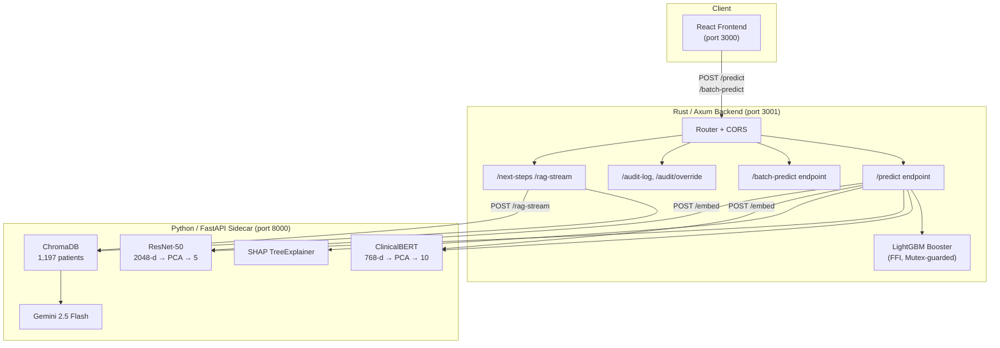
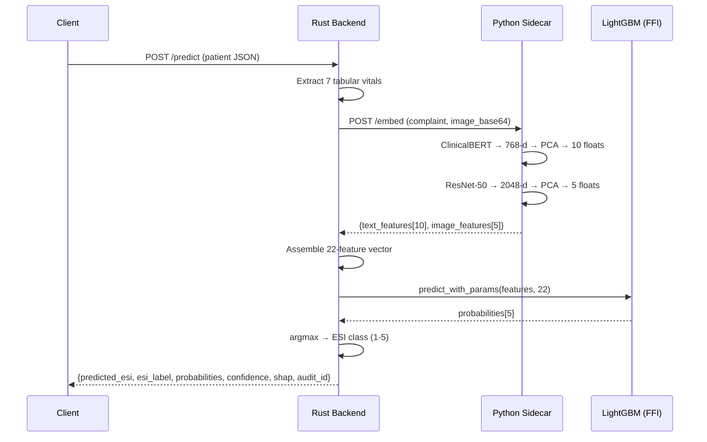
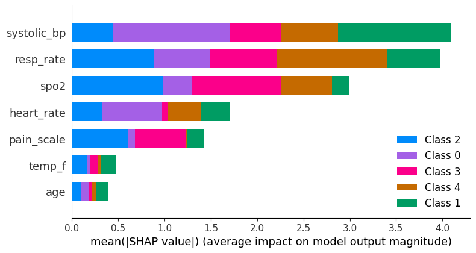
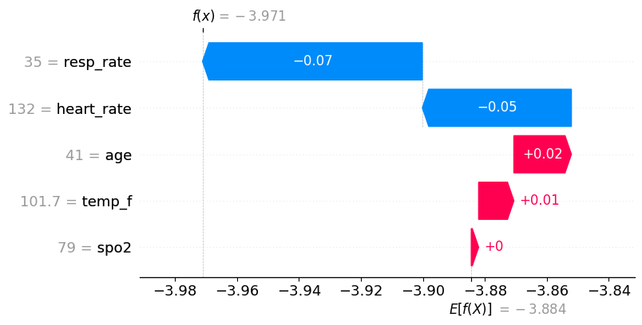

# Frostbyte: Multimodal AI Triage Decision Support

A production-grade late-fusion multimodal AI system that predicts Emergency Severity Index (ESI) levels for emergency department triage. The system fuses three clinical data modalities — structured vitals, unstructured text, and medical imagery — through a LightGBM meta-model served via a high-performance Rust backend, augmented by a Retrieval-Augmented Generation (RAG) engine for clinical decision support.


---

## Table of Contents

1. [Why This Matters](#why-this-matters)
2. [Live System Capabilities](#live-system-capabilities)
3. [Demo Walkthrough](#demo-walkthrough)
4. [System Architecture](#system-architecture)
5. [Technology Stack](#technology-stack)
6. [Data Engineering Pipeline](#data-engineering-pipeline)
7. [Model Training and Results](#model-training-and-results)
8. [Clinical RAG Engine](#clinical-rag-engine)
9. [Rust Inference Backend](#rust-inference-backend)
10. [Setup and Quickstart](#setup-and-quickstart)
11. [API Reference](#api-reference)
12. [Project Structure](#project-structure)
13. [Key Design Decisions](#key-design-decisions)
14. [Research Prototype](#research-prototype)
15. [License](#license)

---

## Why This Matters

Emergency departments face an **accuracy paradox**. Critical patients (ESI 1 — Resuscitation) represent fewer than 2% of all ED visits. Standard ML models trained on raw clinical data default to moderate acuity predictions (ESI 3), achieving high aggregate accuracy while systematically failing on the cases where failure has lethal consequences.

**Our approach:** Hybrid dataset with 197 real MIMIC-IV-ED patients + 1,000 synthetically generated patients with deterministic physiological profiles forced to preserve minority-class decision boundaries.

**Key result:** 90% overall accuracy with **1.00 precision and 1.00 recall on ESI 1 (Resuscitation)** — zero missed critical patients in evaluation.

---

## Live System Capabilities

### 1. Single-Patient Triage

The core HUD workflow for live triage decisions.

**Flow:**
1. Enter patient vitals + chief complaint (+ optional wound/burn image)
2. Rust backend orchestrates feature extraction via Python sidecar (ClinicalBERT + ResNet-50)
3. 22-feature multimodal vector assembled (7 vitals + 10 text PCA + 5 image PCA)
4. LightGBM FFI inference → ESI prediction (1-5)
5. Real-time SHAP explainability computed
6. Confidence/uncertainty metrics populated
7. Audit trail logged to SQLite

**Request:**
```bash
curl -X POST http://localhost:3001/predict \
  -H "Content-Type: application/json" \
  -d '{
    "age": 72,
    "heart_rate": 145,
    "resp_rate": 38,
    "spo2": 78,
    "temp_f": 101.2,
    "systolic_bp": 72,
    "pain_scale": 0,
    "chief_complaint": "Unresponsive, found on floor"
  }'
```

**Response:**
```json
{
  "predicted_esi": 1,
  "esi_label": "ESI 1 (Resuscitation)",
  "probabilities": [0.89, 0.06, 0.02, 0.02, 0.01],
  "confidence": {
    "top_probability": 0.89,
    "is_uncertain": false
  },
  "shap": {
    "features": [
      {"name": "spo2", "value": 78, "shap_value": 1.234},
      {"name": "systolic_bp", "value": 72, "shap_value": 0.987}
    ]
  },
  "audit_id": "abc123"
}
```

### 2. Dual-Path Hybrid Evidence Retrieval

RAG engine that retrieves similar historical patients and generates grounded clinical recommendations.

**Unlike single-path text retrieval** — this system uses two independent retrieval paths:

- **Path A (Text):** ClinicalBERT cosine similarity (captures semantic similarity in chief complaint language)
- **Path B (Vitals/ESI):** Metadata-filtered retrieval ranked by physiological z-score similarity

Candidates from both paths are merged, deduplicated, and scored with an ESI acuity boost (+15%) for candidates within ±1 level of predicted ESI.

**Live endpoint:** `/rag-stream` (SSE streaming)

### 3. SHAP Explainability

Real-time per-patient explainability via `shap.TreeExplainer`:

- **Top SHAP drivers:** Which features pushed the prediction
- **Directionality:** Positive/negative contribution to predicted class
- **Confidence metrics:** `top_probability` and `is_uncertain` flag

Every prediction includes transparent, auditable reasoning for clinical staff.

### 4. Human Override Flow

Clinicians can override AI decisions and log rationale.

**Endpoint:** `POST /audit/override`

```json
{
  "audit_id": "abc123",
  "override_esi": 2,
  "reason": "Patient ambulatory, vitals normalized after initial fluid resuscitation"
}
```

All overrides logged to SQLite audit trail with full audit history queryable via `/audit-log`.

### 5. MCI Mode (Mass Casualty Incident)

Batch triage for mass casualty scenarios — processes 10-100 patients in parallel via Rust FFI.

**Endpoint:** `POST /batch-predict`

```json
{
  "patients": [
    {"age": 45, "heart_rate": 110, "chief_complaint": "Chest pain", ...},
    {"age": 28, "heart_rate": 95, "chief_complaint": "Laceration", ...}
  ]
}
```

Returns ESI distribution, latency, and throughput stats.

---

## Demo Walkthrough

### Scenario 1: Critical Patient (ESI 1)

**Chief complaint:** "Unresponsive, found on floor"

| Input | Value |
|:------|:------|
| Age | 72 |
| Heart Rate | 145 |
| SpO2 | 78% |
| Systolic BP | 72 mmHg |
| Pain Scale | 0 |

**Expected output:** ESI 1 (Resuscitation) — high confidence due to critical SpO2 and hypotension.

**Demo steps:**
1. Enter vitals in Telemetry pane
2. Watch extraction → routing → inference phases
3. Observe ESI 1 hero display with SHAP values showing SpO2/SBP as top drivers
4. Stream RAG recommendations
5. Verify audit trail entry created

### Scenario 2: Chest Pain (ESI 2)

**Chief complaint:** "Crushing chest pain radiating to left arm"

| Input | Value |
|:------|:------|
| Age | 55 |
| Heart Rate | 118 |
| SpO2 | 92% |
| Systolic BP | 185 mmHg |
| Pain Scale | 9 |

**Expected output:** ESI 2 (Emergent) — elevated HR, high pain, concerning cardiac presentation.

### Scenario 3: Ankle Sprain (ESI 4)

**Chief complaint:** "Twisted ankle on stairs"

| Input | Value |
|:------|:------|
| Age | 34 |
| Heart Rate | 88 |
| SpO2 | 99% |
| Systolic BP | 120 mmHg |
| Pain Scale | 5 |

**Expected output:** ESI 4 (Less Urgent)

### Scenario 4: MCI Batch Triage

1. Switch to MCI Mode
2. Select 25 simulated patients
3. Click "Execute Batch Triage"
4. Review ESI distribution bar
5. Examine per-patient predictions with confidence

---

## System Architecture

The production system is a two-process microservice architecture. The Rust backend handles routing, feature assembly, and native LightGBM inference via FFI. The Python sidecar handles ML preprocessing that requires HuggingFace models.


```mermaid
flowchart TB
    subgraph Client
        FE["React Frontend<br/>(port 3000)"]
    end

    subgraph Rust["Rust / Axum Backend (port 3001)"]
        Router["Router + CORS"]
        Predict["/predict endpoint"]
        Batch["/batch-predict endpoint"]
        Audit["/audit-log, /audit/override"]
        Next["/next-steps /rag-stream"]
        LGB["LightGBM Booster<br/>(FFI, Mutex-guarded)"]

        Router --> Predict
        Router --> Batch
        Router --> Audit
        Router --> Next
        Predict --> LGB
    end

    subgraph Python["Python / FastAPI Sidecar (port 8000)"]
        BERT["ClinicalBERT<br/>768-d → PCA → 10"]
        ResNet["ResNet-50<br/>2048-d → PCA → 5"]
        Chroma["ChromaDB<br/>1,197 patients"]
        Gemini["Gemini 2.5 Flash"]
        SHAP["SHAP TreeExplainer"]

        Predict --> BERT
        Predict --> ResNet
        Next --> Chroma --> Gemini
        Predict --> SHAP
    end

    FE -- "POST /predict<br/>/batch-predict" --> Router
    Predict -- "POST /embed" --> BERT
    Predict -- "POST /embed" --> ResNet
    Next -- "POST /rag-stream" --> Chroma
```

### Request Flow: `/predict`


```mermaid
sequenceDiagram
    participant C as Client
    participant R as Rust Backend
    participant P as Python Sidecar
    participant L as LightGBM (FFI)

    C->>R: POST /predict (patient JSON)
    R->>R: Extract 7 tabular vitals
    R->>P: POST /embed (complaint, image_base64)
    P->>P: ClinicalBERT → 768-d → PCA → 10 floats
    P->>P: ResNet-50 → 2048-d → PCA → 5 floats
    P-->>R: {text_features[10], image_features[5]}
    R->>R: Assemble 22-feature vector
    R->>L: predict_with_params(features, 22)
    L-->>R: probabilities[5]
    R->>R: argmax → ESI class (1-5)
    R-->>C: {predicted_esi, esi_label, probabilities, confidence, shap, audit_id}
```

---

## Technology Stack

| Layer | Technology | Role |
|:------|:-----------|:-----|
| Inference Backend | Rust 2021, Axum 0.8, Tokio | Async HTTP, request routing, CORS |
| ML Inference | LightGBM via `lightgbm3` FFI | Native 5-class ESI prediction |
| Text Embeddings | `emilyalsentzer/Bio_ClinicalBERT` | 768-d [CLS] token extraction |
| Vision Embeddings | ResNet-50 (ImageNet) | 2048-d feature maps |
| Dimensionality Reduction | scikit-learn PCA | Text: 768→10, Image: 2048→5 |
| Vector Database | ChromaDB (in-memory, HNSW) | Patient retrieval |
| LLM Generation | Google Gemini 2.5 Flash | Guardrailed clinical recommendations |
| Preprocessing | Python 3.10+, FastAPI | ML model serving sidecar |
| Explainability | SHAP `TreeExplainer` | Local + global feature importance |
| Audit Trail | SQLite | Decision logging + override tracking |

---

## Data Engineering Pipeline

### Dataset Construction

The system uses a hybrid dataset combining real and synthetic patients:

| Source | Count | Purpose |
|:-------|:------|:--------|
| MIMIC-IV-ED | 197 real patients | Real clinical data anchor |
| Synthetic Generator | 1,000 patients (200 per ESI) | Class-balanced training |
| Kaggle Medical Images | ~260 burn/wound photos | Vision modality |

### Feature Vector Layout

The master dataset contains 22 features used for model inference:

```
Index  0-6:   Tabular Vitals    [age, heart_rate, resp_rate, spo2, temp_f, systolic_bp, pain_scale]
Index  7-16:  Text PCA           [text_feat_0 .. text_feat_9]
Index  17-21: Image PCA          [img_feat_0 .. img_feat_4]
```

### Modality Details

**Tabular Vitals (7 features):** Raw physiological measurements passed directly to the model.

**Text Embeddings:** ClinicalBERT `[CLS]` token → 768-d → PCA → 10-d.

**Vision Features:** ResNet-50 feature map → 2048-d → PCA → 5-d.

**Missing modality handling:** Patients without images receive zero-padded image vectors `[0.0, 0.0, 0.0, 0.0, 0.0]`. PCA is fitted exclusively on real images to preserve this mathematical "off-switch."

---

## Model Training and Results

### Production Model: LightGBM Late-Fusion

| Parameter | Value |
|:----------|:------|
| Algorithm | LightGBM (`LGBMClassifier`) |
| Estimators | 200 |
| Learning Rate | 0.05 |
| Max Depth | 6 |
| Class Weight | `balanced` |
| Train/Test Split | 80/20 stratified |

**Overall Accuracy: 90%**

**ESI 1 (Resuscitation): 1.00 precision, 1.00 recall** — zero missed critical patients.

### SHAP Explainability

The system uses `shap.TreeExplainer` to generate:
- **Global Feature Importance** — Bar chart showing which features drive decisions
- **Local Waterfall** — Per-patient explanation: "Why was this patient classified as ESI 1?"

These visualizations solve the medical "black box" problem by providing clinical staff with transparent, auditable reasoning for every triage decision.

| Global Feature Importance | Critical Patient Waterfall |
|:------------------------:|:--------------------------:|
|  |  |

### Model Artifacts

| File | Format | Description |
|:-----|:-------|:------------|
| `triage_multimodal_model.txt` | LightGBM native text | 19,157-line model dump loaded by Rust FFI |
| `triage_multimodal_model.pkl` | Python pickle | Scikit-learn compatible serialization |

---

## Clinical RAG Engine

### Dual-Path Hybrid Retrieval

Standard single-path text retrieval fails when semantically dissimilar complaints describe physiologically identical emergencies. For example, "Unresponsive, found on floor" and "Cardiac arrest" describe ESI 1 with similar vitals, but ClinicalBERT may place them in distant embedding clusters.

**Path A (Text):** ClinicalBERT cosine similarity — captures semantic similarity in chief complaint language.

**Path B (Vitals/ESI):** Filters ChromaDB by ESI metadata (predicted ESI ±1), ranks by physiological z-score similarity.

**Merge and Scoring:**

| Source | Formula |
|:-------|:--------|
| `"both"` | `alpha * text_sim + (1 - alpha) * vitals_sim` |
| `"text"` | Same formula with computed vitals similarity |
| `"vitals"` | Pure vitals similarity (no text penalty) |

**Tuning:** `ALPHA = 0.5`, `ESI_BOOST = +15%`, `TEXT_POOL_SIZE = 50`, `VITALS_POOL_SIZE = 200`.

### Generation Guardrails

The Gemini prompt includes strict safety constraints:
- Never prescribe specific medications or dosages
- Never make definitive diagnoses
- Always recommend physician confirmation
- Only suggest actions aligned with retrieved cases
- Explicitly identified as decision support, not diagnostics

---

## Rust Inference Backend

### Thread Safety

LightGBM's C API exposes a raw pointer to a `BoosterHandle`. The solution is a newtype wrapper with explicit safety contracts:

```rust
pub struct SendBooster(pub Booster);

// SAFETY: Booster is guarded by Mutex — only one thread accesses at a time.
unsafe impl Send for SendBooster {}
unsafe impl Sync for SendBooster {}
```

The `SendBooster` is wrapped in `Option<Mutex<...>>` inside `AppState`, which is wrapped in `Arc<...>`. This guarantees:
- **Arc:** Shared ownership across async handler tasks
- **Mutex:** Serialized access to the C handle
- **Option:** Enables degraded mode when model unavailable

### Degraded Mode

If the LightGBM model file is missing at startup:
- `/health` reports `model_loaded: false`
- `/predict` returns HTTP 503
- `/next-steps` continues to function (uses vitals-based heuristic fallback)

### Heuristic Fallback

When model unavailable, `/next-steps` uses rule-based ESI estimation:

| Condition | Assigned ESI |
|:----------|:-------------|
| SpO2 < 85% or SBP < 80 mmHg | ESI 1 |
| HR > 120 bpm or SpO2 < 92% | ESI 2 |
| Pain >= 7 or HR > 100 bpm | ESI 3 |
| Pain >= 4 | ESI 4 |
| Otherwise | ESI 5 |

---

## Setup and Quickstart

### Prerequisites

- Python 3.10+
- Rust 1.70+ (with Cargo)
- LightGBM C library
- Gemini API key (optional for RAG generation)

### Quick Start (One-Command)

```bash
./startup.sh
```

This will:
1. Start Python preprocessing service (port 8000)
2. Start Rust backend (port 3001)
3. Start Next.js frontend (port 3000)
4. Wait for all services to be ready
5. Print status and URLs

```bash
./smoke.sh   # Verify all services
./shutdown.sh # Stop all services
```

### Manual Start (Step-by-Step)

```bash
# 1. Install Python dependencies
pip install -r requirements.txt

# 2. Set environment variables
export GEMINI_API_KEY="your-gemini-api-key"
export TRIAGE_MODEL_PATH="./triage_multimodal_model.txt"

# 3. Start Python sidecar
uvicorn preprocessing_service:app --host 0.0.0.0 --port 8000

# 4. Build and run Rust backend
cd backend
TRIAGE_MODEL_PATH="../triage_multimodal_model.txt" cargo run --release

# 5. Start frontend (optional)
cd frontend && npm run dev
```

### Verify

```bash
curl http://localhost:3001/health

curl -X POST http://localhost:3001/predict \
  -H "Content-Type: application/json" \
  -d '{"age": 72, "heart_rate": 145, "resp_rate": 38, "spo2": 78, "temp_f": 101.2, "systolic_bp": 72, "pain_scale": 0, "chief_complaint": "Unresponsive, found on floor"}'

curl -X POST http://localhost:3001/batch-predict \
  -H "Content-Type: application/json" \
  -d '{"patients": [{"age": 55, "heart_rate": 118, "resp_rate": 24, "spo2": 92, "temp_f": 98.6, "systolic_bp": 185, "pain_scale": 9, "chief_complaint": "Chest pain"}]}'
```

---

## API Reference

| Endpoint | Method | Description |
|:---------|:-------|:----------|
| `/health` | GET | Liveness probe |
| `/predict` | POST | Single-patient triage inference |
| `/batch-predict` | POST | Batch MCI triage |
| `/next-steps` | POST | RAG clinical recommendations |
| `/rag-stream` | POST | SSE streaming RAG |
| `/shap` | POST | SHAP explainability |
| `/audit-log` | GET | Query audit trail |
| `/audit/override` | POST | Record clinician override |

---

## Project Structure

```
triage-submission-story/
├── backend/                           # Rust inference backend
│   ├── Cargo.toml
│   ├── Cargo.lock
│   └── src/
│       ├── main.rs                    # Entry point
│       ├── models.rs                  # DTOs
│       ├── state.rs                   # AppState
│       └── routes/                    # /predict, /batch-predict, /audit/*
├── frontend/                          # Next.js Obsidian HUD
│   └── src/components/                # TelemetryPane, AICorePane, MCIMode, RAGIntelligencePane
├── preprocessing_service.py            # Python FastAPI: /embed, /shap, /rag, /rag-stream
├── docs/ai/                           # Working notes
├── startup.sh                         # One-command startup
├── smoke.sh                           # Health verification
├── shutdown.sh                        # Stop all services
├── triage_multimodal_model.txt        # LightGBM model (FFI)
├── triage_master_multimodal.csv       # 1,197 patients × 25 columns
├── clinicalbert_embeddings_768d.npy   # Pre-computed embeddings
└── kaggle_images/                    # Burn/wound images
```

---

## Key Design Decisions

1. **Late fusion over early fusion:** Tree-based meta-model on concatenated features provides robust gradient boosting with interpretable SHAP values.

2. **Dual-path retrieval:** Text similarity alone fails when semantically dissimilar complaints describe physiologically identical emergencies. Hybrid approach captures both.

3. **Class-balanced training:** Synthetic data forces minority-class representation to prevent silent failures on critical patients.

4. **FFI over RPC:** Rust ↔ LightGBM direct memory avoids serialization overhead and provides <10ms inference latency.

5. **Human-in-the-loop:** Override flow ensures clinician accountability and builds trust for deployment.

---

## Research Prototype

The `pytorch_fusion_model.py` implements a cross-attention neural architecture as the scalable V2 successor — designed for enterprise data lakes (50K+ patients). Not deployed due to current data constraints.

---

## License

MIMIC-IV-ED data usage governed by PhysioNet terms. Synthetic data freely distributable.